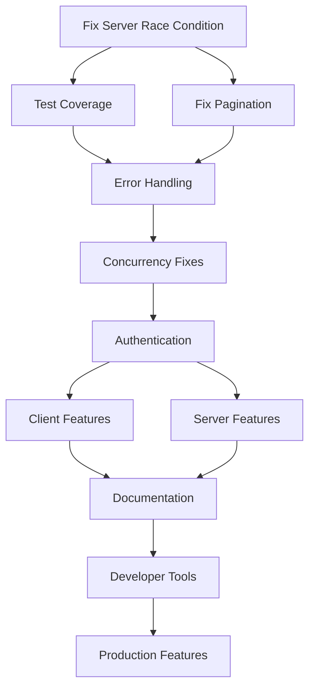

# Go MCP SDK Enhancement Plan - Comprehensive Task List

## Executive Summary

This plan provides a comprehensive task list to elevate the Go MCP SDK to match the quality and features of official MCP implementations. Tasks are organized by priority and dependencies, with **critical server issues** identified through deep analysis now integrated into the plan.

## Current State Assessment

### Overall SDK Health
- **Client**: 88% test coverage ✅ (improved from 14%), missing key features
- **Server**: 85.4% test coverage ✅ (improved from 24.8%), **race conditions** ✅ (fixed), broken pagination ✅ (fixed)
- **Transport**: 19% test coverage, missing features
- **Protocol**: 89.4% test coverage (good)

### Critical Server Issues (NEW)
- 🔴 **Race condition** in server initialization
- 🔴 **Broken pagination** implementation (cursor encoding)
- 🔴 **Missing features**: Resource subscriptions, request cancellation
- ⚠️ **Protocol non-compliance**: Hardcoded version, no capability validation

## Success Criteria

- **Test Coverage**: ≥80% across all packages
- **Feature Completeness**: 100% MCP 2025-03-26 spec compliance
- **Performance**: Match or exceed TypeScript SDK benchmarks
- **Developer Experience**: Comprehensive docs, examples, and tooling
- **Security**: Full authentication and authorization support
- **Production Ready**: Enterprise-grade quality, no race conditions

## Task Organization

Tasks are organized into:
- 🚨 **P0 (Critical)**: Must fix immediately - blocking issues, security/stability
- ⚠️ **P1 (High)**: Core functionality - required for spec compliance
- 📋 **P2 (Medium)**: Important features - enhances usability
- 💡 **P3 (Low)**: Nice to have - future enhancements

## Task List

### 🚨 P0: Critical Foundation Tasks

#### Server Critical Fixes (NEW - HIGHEST PRIORITY)
- [x] **Fix Server Race Condition in handleInitialize** ✅ COMPLETED
  - [x] Add mutex protection for `clientInfo` assignment
  - [x] Protect all shared state modifications
  - [x] Add concurrent access tests
  - [x] Verify with race detector
  ```go
  // Current bug:
  s.clientInfo = initParams.ClientInfo  // RACE!
  // Fix:
  s.initializedLock.Lock()
  s.clientInfo = initParams.ClientInfo
  s.initialized = true
  s.initializedLock.Unlock()
  ```

- [x] **Fix Broken Pagination Implementation** ✅ COMPLETED
  - [x] Replace broken cursor encoding (`string(rune(end))`)
  - [x] Implement base64-encoded JSON cursors
  - [x] Add cursor validation and error handling
  - [x] Test with large datasets
  - [x] Handle nil pagination params properly
  ```go
  // Fixed: Replaced string(rune(end)) with proper base64-encoded JSON cursors
  // Added encodeCursor/decodeCursor functions with proper error handling
  ```

- [x] **Add Panic Recovery** ✅ COMPLETED
  - [x] Implement panic recovery in transport layer (HandleRequest/HandleNotification)
  - [x] Add panic recovery in critical goroutines (stdio, http_handler)
  - [x] Log panics with full stack traces
  - [x] Return proper JSON-RPC error responses on panic
  - [x] Add comprehensive tests for panic recovery

#### Test Coverage Emergency
- [x] **Client Package Testing** (Current: 14% → Target: 85%) ✅ COMPLETED (88% coverage achieved!)
  - [x] Test Client initialization and configuration
  - [x] Test request/response handling
  - [x] Test capability negotiation
  - [x] Test error scenarios
  - [x] Test timeout and cancellation
  - [x] Add table-driven tests for all public methods

- [x] **Server Package Testing** (Current: 24.8% → Target: 85%) ✅ COMPLETED (85.4% coverage achieved!)
  - [x] Test Server initialization with race detection
  - [x] Test concurrent request handling
  - [x] Test provider registration and routing
  - [x] Test capability advertisement
  - [x] Test pagination implementation
  - [x] Test HTTP handler functionality (SSE, sessions, CORS)
  - [x] Test notification methods
  - [x] Test protocol method handlers
  - [x] Test error handling scenarios
  - [ ] Add server concurrency tests
  - [ ] Test error propagation
  - [ ] Add integration tests with mock transport

- [~] **Transport Package Testing** (Current: 19% → ~50% → Target: 80%) ⚡ IN PROGRESS
  - [x] Test stdio transport completely
  - [x] Test HTTP transport with SSE
  - [x] Test StreamableHTTP transport
  - [x] Add transport error scenarios
  - [x] Test reconnection logic (partial - some tests timing out)
  - [ ] Add concurrency stress tests
  - [x] Fixed StreamableHTTPTransport response handling
  - [x] Fixed HTTPTransport shutdown issues
  - [x] Fixed EventSource content-type validation
  - [ ] Debug remaining test timeouts

#### Concurrency & Race Conditions
- [x] **Fix Server Concurrency Issues** ✅ COMPLETED
  - [x] Audit all server mutex usage
  - [x] Fix base provider race conditions (BaseToolsProvider, BaseResourcesProvider, BasePromptsProvider, BaseRootsProvider)
  - [x] Add read/write locks where appropriate (HTTPHandler and all base providers)
  - [x] Create comprehensive race condition tests
  - [ ] Implement request ID tracking for deduplication

- [x] **Fix StreamableHTTP Race Conditions** ✅ COMPLETED
  - [x] Fix processEventSource goroutine management with channel-based synchronization
  - [x] Fix concurrent field access (LastEventID, headers, etc.) with proper mutex protection
  - [x] Ensure proper cleanup on context cancellation with improved Close() method
  - [x] Fix HandleResponse to properly clean up handlers and check pending requests
  - [ ] Add race detector to CI pipeline

- [ ] **Goroutine Management**
  - [ ] Implement goroutine leak detection
  - [ ] Add proper cleanup in all transports
  - [ ] Use errgroup for coordinated shutdown
  - [ ] Add goroutine pool for request handling

#### Error Handling Standardization
- [ ] **Create Error Package** (`/pkg/errors/`)
  - [ ] Define custom error types (ValidationError, NotFoundError, etc.)
  - [ ] Implement error codes from spec
  - [ ] Add error wrapping utilities
  - [ ] Create error categorization logic
  - [ ] Map errors to proper JSON-RPC codes

- [ ] **Implement Consistent Error Handling**
  - [ ] Update all packages to use error package
  - [ ] Add context to all errors
  - [ ] Replace generic "internal error" responses
  - [ ] Implement error logging standards
  - [ ] Add error metrics collection

### ⚠️ P1: Core Feature Implementation

#### Server Core Features (UPDATED)
- [ ] **Implement Request Cancellation**
  - [ ] Track active requests by ID
  - [ ] Implement actual cancellation logic
  - [ ] Handle context cancellation properly
  - [ ] Test cancellation scenarios

- [ ] **Implement Resource Subscriptions**
  - [ ] Design subscription event system
  - [ ] Implement change notification mechanism
  - [ ] Add subscription state management
  - [ ] Handle reconnection scenarios
  - [ ] Create subscription examples

- [ ] **Fix Protocol Compliance Issues**
  - [ ] Make protocol version configurable
  - [ ] Implement client capability validation
  - [ ] Make setCapability actually work
  - [ ] Add protocol version negotiation

- [ ] **Add Server Middleware Support**
  - [ ] Design middleware interface
  - [ ] Implement middleware chain
  - [ ] Add request/response interceptors
  - [ ] Create logging middleware
  - [ ] Add auth middleware
  - [ ] Document middleware patterns

- [ ] **Implement Structured Logging**
  - [ ] Replace basic logger interface
  - [ ] Add structured logging support
  - [ ] Implement log levels properly
  - [ ] Add request ID to all logs
  - [ ] Create logging middleware

#### Authentication System
- [ ] **Design Authentication Framework**
  - [ ] Create `AuthProvider` interface
  - [ ] Design token storage interface
  - [ ] Plan middleware integration
  - [ ] Document security model

- [ ] **Implement OAuth 2.1**
  - [ ] Create OAuth provider implementation
  - [ ] Add token refresh logic
  - [ ] Implement PKCE flow
  - [ ] Add token validation
  - [ ] Create auth examples

- [ ] **Add Authentication Middleware**
  - [ ] Transport-level auth injection
  - [ ] Request authentication
  - [ ] Token refresh on 401
  - [ ] Secure credential storage

#### Client Feature Completion
- [ ] **Sampling Implementation**
  - [ ] Design sampling callback interface
  - [ ] Implement sampling request handling
  - [ ] Add sampling response processing
  - [ ] Create sampling examples
  - [ ] Add sampling tests

- [ ] **Resource Subscriptions** (Client side)
  - [ ] Design subscription interface
  - [ ] Implement change notifications
  - [ ] Add subscription management
  - [ ] Handle reconnection state
  - [ ] Test subscription lifecycle

- [ ] **Request Management**
  - [ ] Implement retry with exponential backoff
  - [ ] Add request queuing
  - [ ] Implement request prioritization
  - [ ] Add circuit breaker pattern
  - [ ] Create request timeout handling

- [ ] **Progress Tracking**
  - [ ] Implement progress callback system
  - [ ] Add progress reporting to long operations
  - [ ] Create progress visualization examples
  - [ ] Test progress edge cases

#### Transport Completion
- [ ] **StreamableHTTP Enhancements**
  - [ ] Add DELETE method support
  - [ ] Implement stateless mode
  - [ ] Add origin validation
  - [ ] Implement event replay
  - [ ] Add batch optimization

- [ ] **WebSocket Transport**
  - [ ] Design WebSocket transport
  - [ ] Implement bidirectional messaging
  - [ ] Add reconnection logic
  - [ ] Implement ping/pong
  - [ ] Create WebSocket examples

- [ ] **Transport Features**
  - [ ] Implement connection pooling
  - [ ] Add compression support
  - [ ] Create transport metrics
  - [ ] Add transport interceptors
  - [ ] Implement transport selection logic

### 📋 P2: Developer Experience

#### Documentation
- [ ] **API Documentation**
  - [ ] Document all public APIs
  - [ ] Add usage examples to godoc
  - [ ] Create API reference site
  - [ ] Add code snippets
  - [ ] Generate OpenAPI specs

- [ ] **Guides and Tutorials**
  - [ ] Write Getting Started guide
  - [ ] Create architecture guide
  - [ ] Write security best practices
  - [ ] Add troubleshooting guide
  - [ ] Create migration guide

- [ ] **Examples Enhancement**
  - [ ] Example for every feature
  - [ ] Real-world use cases
  - [ ] Provider implementation examples
  - [ ] Integration examples
  - [ ] Performance examples
  - [ ] Security examples

#### Testing Utilities
- [ ] **Mock Implementations**
  - [ ] Create MockClient
  - [ ] Create MockServer
  - [ ] Add MockTransport
  - [ ] Create test helpers
  - [ ] Document testing patterns

- [ ] **Testing Framework**
  - [ ] Add test data generators
  - [ ] Create assertion helpers
  - [ ] Add integration test utilities
  - [ ] Create benchmark suite
  - [ ] Add fuzzing tests

#### Developer Tools
- [ ] **Code Generation**
  - [ ] Provider code generator
  - [ ] Client stub generator
  - [ ] Type definition generator
  - [ ] Documentation generator
  - [ ] Test generator

- [ ] **CLI Tools**
  - [ ] MCP server runner
  - [ ] Client testing tool
  - [ ] Protocol analyzer
  - [ ] Performance profiler
  - [ ] Debug tools

#### CI/CD Enhancement
- [ ] **Pipeline Improvements**
  - [ ] Add coverage reporting
  - [ ] Implement performance tests
  - [ ] Add security scanning
  - [ ] Create release automation
  - [ ] Add compatibility tests
  - [ ] Add race detection in CI

### 💡 P3: Production & Advanced Features

#### Performance Optimization
- [ ] **Memory Optimization**
  - [ ] Implement buffer pools
  - [ ] Optimize JSON handling
  - [ ] Add streaming support
  - [ ] Profile memory usage
  - [ ] Create benchmarks

- [ ] **Network Optimization**
  - [ ] Optimize connection reuse
  - [ ] Implement request batching
  - [ ] Add caching layer
  - [ ] Optimize protocol overhead
  - [ ] Add compression

#### Observability
- [ ] **Metrics System**
  - [ ] Design metrics interface
  - [ ] Add Prometheus support
  - [ ] Implement custom metrics
  - [ ] Create dashboards
  - [ ] Add alerting rules

- [ ] **Logging & Tracing**
  - [ ] Structured logging
  - [ ] Distributed tracing
  - [ ] Request correlation
  - [ ] Performance profiling
  - [ ] Debug logging

#### Security Hardening
- [ ] **Security Features**
  - [ ] Rate limiting
  - [ ] Input sanitization
  - [ ] Audit logging
  - [ ] Security headers
  - [ ] Vulnerability scanning

- [ ] **Compliance**
  - [ ] GDPR compliance
  - [ ] SOC2 requirements
  - [ ] Security documentation
  - [ ] Penetration testing
  - [ ] Security review process

#### Enterprise Features
- [ ] **Advanced Capabilities**
  - [ ] Multi-tenancy
  - [ ] RBAC implementation
  - [ ] Data encryption
  - [ ] Enterprise auth providers
  - [ ] Compliance logging

- [ ] **Protocol Extensions**
  - [ ] Extension framework
  - [ ] Custom capabilities
  - [ ] Protocol negotiation
  - [ ] Extension registry
  - [ ] Extension documentation

## Task Dependencies



## Execution Strategy

### Immediate Actions (This Week)
1. **Fix server race condition** - Critical security/stability issue
2. **Fix pagination implementation** - Functional bug affecting all list operations
3. **Set up race detection in CI** - Prevent future issues
4. **Add panic recovery** - Improve stability

### Quick Wins (Can start immediately)
1. Set up coverage reporting in CI
2. Add table-driven tests for existing code
3. Fix obvious race conditions
4. Standardize error messages
5. Implement proper cursor encoding

### Parallel Tracks
- **Track 1**: Critical fixes (race condition, pagination)
- **Track 2**: Test coverage (can progress independently)
- **Track 3**: Core features (after critical fixes)
- **Track 4**: Documentation (can start anytime)

### Critical Path
1. Fix server race condition and pagination
2. Fix test coverage for client/server packages
3. Fix remaining concurrency issues
4. Implement authentication
5. Complete core client/server features
6. Enhance documentation and tooling

## Success Metrics

### Week 1 Metrics
- Server race condition fixed
- Pagination implementation corrected
- Test coverage increased by 20%
- Race detection added to CI

### Sprint Metrics (2-week cycles)
- Test coverage increase of 10% per sprint
- Zero new race conditions
- At least 5 features completed per sprint
- Documentation for all new features

### Milestone Metrics
- **M1**: Critical fixes complete, 50% test coverage
- **M2**: 80% test coverage achieved
- **M3**: Authentication fully implemented
- **M4**: Feature parity with TypeScript SDK
- **M5**: Production deployments successful

## Production Readiness Timeline

### Current State
- **Development Use**: Ready with caveats ⚠️
- **Production Use**: NOT READY ❌

### Timeline to Production
- **Week 1**: Fix critical issues (race condition, pagination)
- **Weeks 2-3**: Achieve 80% test coverage
- **Weeks 4-6**: Implement core features
- **Week 8**: Production ready for early adopters
- **Week 12**: Enterprise ready with full features

## Risk Mitigation

### Technical Risks
- **Risk**: Race conditions in production
  - **Mitigation**: Fix immediately, add race detection, stress testing

- **Risk**: Breaking changes to existing API
  - **Mitigation**: Comprehensive test suite, deprecation policy

- **Risk**: Performance regression
  - **Mitigation**: Benchmark suite, performance tests in CI

- **Risk**: Security vulnerabilities
  - **Mitigation**: Security scanning, regular audits, panic recovery

### Process Risks
- **Risk**: Scope creep
  - **Mitigation**: Focus on P0 items first, strict prioritization

- **Risk**: Technical debt
  - **Mitigation**: Fix critical issues before adding features

## Conclusion

This comprehensive plan integrates critical server issues discovered through deep analysis. The immediate priority is fixing the race condition and broken pagination, as these are blocking production use. With focused effort on P0 tasks, the SDK can be production-ready in 6-8 weeks and enterprise-ready in 10-12 weeks.
